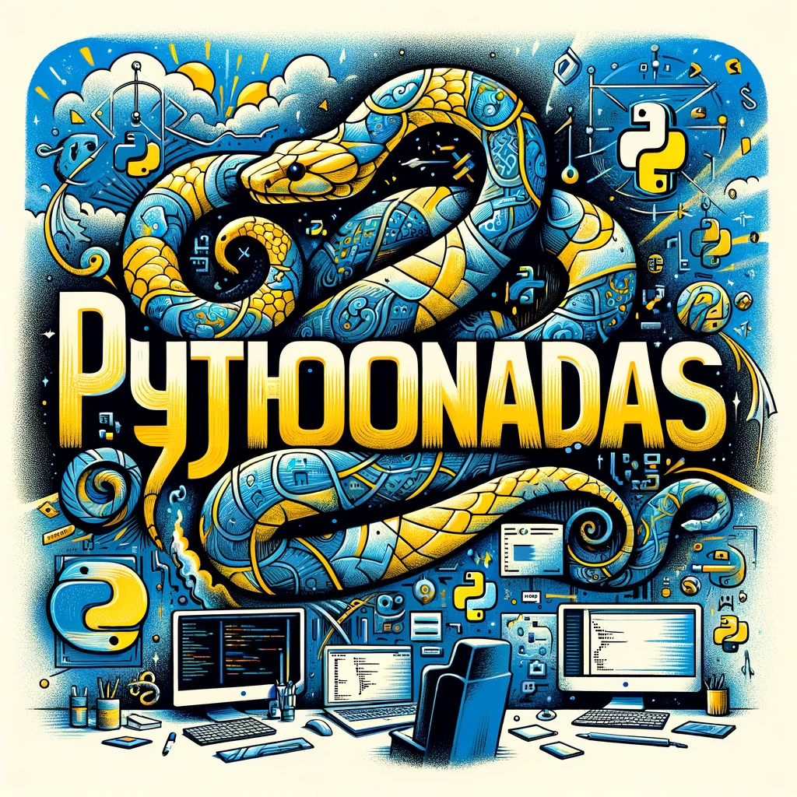

# pythonadas
> Welcome to **pythonadas**, a collection of interesting Python code examples that showcase various programming concepts, techniques, and best practices. Dive into the world of Python with these curated snippets and expand your knowledge and skills in this powerful programming language.

    

## Resources
- [Python3 cheatsheet (ESP)](https://t.co/JiI6SfCLsY)
